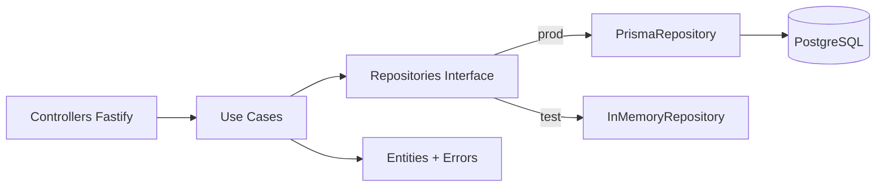

# Contos de Festa

Site vitrine de **peg e monte** com painel admin. Catálogo de kits → cliente monta orçamento → envia pelo WhatsApp; pagamento (PIX) acontece na conversa. Sem carrinho persistente, sem pagamento online — o foco é estar bonito e funcional.

> Stack: **Next.js 16** + Tailwind no front, **Fastify + Prisma + PostgreSQL** no back, **Cloudinary** pra fotos, JWT em cookie `httpOnly` na auth.

## Estrutura de pastas

```
contos-de-festas/
├── api/                          # Backend Fastify (SOLID)
│   ├── prisma/                   # Schema do banco
│   └── src/
│       ├── core/                 # Entity, UniqueEntityID
│       ├── entities/             # Domínio puro (Kit, Category, KitType, ...)
│       ├── use-cases/            # Regras de negócio + factories + errors
│       │   └── factories/        # Composition root (singletons lazy)
│       ├── repositories/         # Interfaces + Prisma + In-memory
│       ├── http/
│       │   ├── controllers/      # Rotas Fastify (uma pasta por recurso)
│       │   └── middlewares/      # verifyJwt, verifyAdmin
│       ├── env/                  # Validação Zod das variáveis
│       ├── lib/                  # Cloudinary, Prisma client
│       ├── test/                 # Helpers de E2E + fakes
│       └── app.ts                # Composição do Fastify (helmet, cookie, jwt, ...)
└── src/                          # Frontend Next.js
    ├── app/                      # Rotas (app router)
    │   ├── admin/                # Painel admin
    │   ├── kits/                 # Catálogo público
    │   └── ...
    ├── components/               # UI (admin/, kits/, layout/, sections/, shared/)
    ├── contexts/                 # AuthContext, QuoteContext
    ├── hooks/api/                # SWR hooks tipados (useKits, useCategories, ...)
    ├── lib/                      # api/client, env (Zod), whatsapp, utils
    └── types/                    # Tipos compartilhados (Kit, Category, ...)
```

## Camadas (backend)



**Regra:** controllers conhecem use cases; use cases só dependem de entities + interfaces de repository. JWT é responsabilidade do controller — o use case `Authenticate` só valida credenciais.

## Como rodar

### Pré-requisitos

- Node 20+
- Docker (para o Postgres local) ou um Postgres rodando em `localhost:5432`

### Setup

```bash
# 1. Instala dependências
npm install

# 2. Copia e edita as variáveis de ambiente
cp .env.example .env
# (preencha JWT_SECRET, ADMIN_REGISTRATION_KEY, CLOUDINARY_*, etc.)

# 3. Sobe o banco
npm run db:up

# 4. Roda as migrations
npm run prisma:migrate

# 5. Sobe front + back (concurrently)
npm run dev
```

Frontend em `http://localhost:3000`, API em `http://localhost:3333`.

### Criar o primeiro admin

A rota `/auth/register` é pública mas exige `adminKey` (`ADMIN_REGISTRATION_KEY` do `.env`). Exemplo:

```bash
curl -X POST http://localhost:3333/auth/register \
  -H "Content-Type: application/json" \
  -d '{
    "name": "Cida",
    "email": "cida@contosdefestas.com",
    "password": "senha-forte-123",
    "adminKey": "<conteúdo de ADMIN_REGISTRATION_KEY>"
  }'
```

Política de senha: ≥10 caracteres + ao menos 1 número.

Depois é só logar em `http://localhost:3000/login`.

## Testes

```bash
npm test               # use cases (in-memory) + e2e (app.inject)
npm run test:watch
npm run test:coverage
```

A suíte usa repositórios in-memory injetados via `setContainerOverrides` (ver `api/src/test/make-e2e-app.ts`) — não precisa de banco rodando para testar.

## Lint & typecheck

```bash
npm run lint
npx tsc --noEmit                 # frontend
npx tsc --noEmit -p api/tsconfig.json  # backend
```

CI roda os três + a suíte em cada push/PR (ver `.github/workflows/ci.yml`).

## Auth

- Login emite JWT como cookie `httpOnly` + `Secure` (em prod) + `SameSite=Lax`.
- `verifyJwt` aceita token vindo do cookie OU do header `Authorization: Bearer ...`.
- `POST /auth/logout` limpa o cookie.
- Rate limit: 10 req/min/IP em `/auth/login` e `/auth/register`.

## Decisões importantes

- **Sem controle de estoque, sem pagamento online**: o backend é um CMS simples (kits + categorias + tipos + fotos).
- **Tipo de Kit vs Categoria**: dois eixos de organização. Tipo = formato (Mesa, Kit 1, ...). Categoria = ocasião (Aniversário, Chá de Bebê, ...). Cada Kit tem um de cada.
- **Imagens**: Cloudinary. Upload via `multipart`, limites: 5MB por arquivo, 1 arquivo por request.
- **Tokens de design**: paleta carmim/rosa/dourado em `src/app/globals.css` exposta via `bg-primary`, `text-foreground`, `bg-accent`, etc.

## Próximos passos (fora do MVP)

- Recuperação de senha (link por email)
- Plataforma de cursos online
- Calendário de disponibilidade
- Blog para SEO
